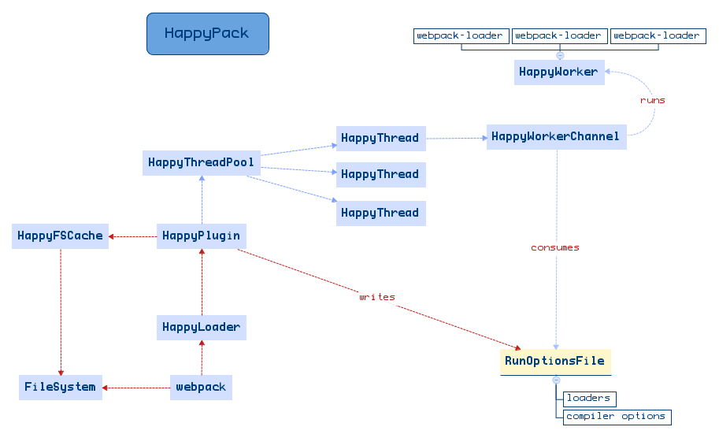

# HappyPack [](https://travis-ci.org/amireh/happypack) [](https://codecov.io/github/amireh/happypack?branch=master)

HappyPack makes initial webpack builds faster by transforming files [in
parallel](#how-it-works).

> **Maintenance mode notice**
>
> My interest in the project is fading away mainly because I'm not using
> JavaScript as much as I was in the past. Additionally, Webpack's native
> performance is improving and (I hope) it will soon make this plugin
> unnecessary.
>
> See the FAQ entry about Webpack 4 and [thread-loader][thread-loader].
>
> Contributions are always welcome. Changes I make from this point will be
> restricted to bug-fixing. If someone wants to take over, feel free to get
> in touch.
>
> Thanks to everyone who used the library, contributed to it and helped in
> refining it!!!

## Usage

```shell
npm install --save-dev happypack
```

HappyPack provides both a plugin and a loader in order to do its job so you
must use both to enable it.

Normally, you define loader rules to tell webpack how to process certain files.
With HappyPack, you switch things around so that you pass the loaders to
HappyPack's plugin and instead tell webpack to use `happypack/loader`.

Below is a sample configuration that shows those steps in action.

```javascript
// @file: webpack.config.js
const HappyPack = require('happypack');

exports.module = {
  rules: [
    {
      test: /.js$/,
      // 1) replace your original list of loaders with "happypack/loader":
      // loaders: [ 'babel-loader?presets[]=es2015' ],
      use: 'happypack/loader',
      include: [ /* ... */ ],
      exclude: [ /* ... */ ]
    }
  ]
};

exports.plugins = [
  // 2) create the plugin:
  new HappyPack({
    // 3) re-add the loaders you replaced above in #1:
    loaders: [ 'babel-loader?presets[]=es2015' ]
  })
];
```

That's it. Now sources that match `.js$` will be handed off to HappyPack which
will transform them in parallel using the loaders you specified (`babel-loader`
in this example.)

## Configuration

These are the parameters you can pass to the plugin when you instantiate it.
`loaders` is the only required parameter.

### `loaders: Array`

Each entry consists of the name (or absolute path) of the loader that
would transform the files and an optional query string to pass to it. This
looks similar to what you'd pass to webpack's `loader` config.

> **Heads up!**
>
> HappyPack doesn't work with *all* webpack loaders as some loader API are not
> supported.
>
> See [this wiki page](https://github.com/amireh/happypack/wiki/Webpack-Loader-API-Support) for more details on current Loader API support.

The following notations are officially supported and are all equivalent:

```javascript
{
  loaders: [
    // a string with embedded query for options
    'babel-loader?presets[]=es2015',

    {
      loader: 'babel-loader'
    },

    // "query" string
    {
      loader: 'babel-loader',
      query:  '?presets[]=es2015'
    },

    // "query" object
    {
      loader: 'babel-loader',
      query: {
        presets: [ 'es2015' ]
      }
    },

    // Webpack 2+ "options" object instead of "query"
    {
      loader: 'babel-loader',
      options: {
        presets: [ 'es2015' ]
      }
    }
  ]
}
```

### `id: String`

A unique id for this happy plugin. This is used by the loader to know which
plugin it's supposed to talk to.

Normally, you would not need to specify this unless you have more than one
HappyPack plugin defined, in which case you'll need distinct IDs to tell them
apart. See [this section](#using-multiple-instances) for more information.

Defaults to: `"1"`

### `threads: Number`

This number indicates how many Node VMs HappyPack will spawn for compiling
the source files. After a lot of tinkering, I found 4 to yield the best
results. There's certainly a diminishing return on this value and increasing
beyond 8 actually slowed things down for me.

Keep in mind that this is only relevant when performing **the initial build**
as HappyPack will switch into a synchronous mode afterwards (i.e. in `watch`
mode.)

Defaults to: `3`

### `threadPool: HappyThreadPool`

A pre-defined thread-pool to use for retrieving worker threads. Normally, this
is managed internally by each `HappyPlugin` instance, but you may override
this behavior for better results.

[The section on thread pools](#shared-thread-pools) explains how and when to
use this.

Defaults to: `null`

### `verbose: Boolean`

Enable this to log status messages from HappyPack to STDOUT like start-up
banner, etc..

Defaults to: `true`

### `verboseWhenProfiling: Boolean`

Enable this if you want HappyPack to still produce its output even when you're
doing a `webpack --profile` run. Since this variable was introduced, HappyPack
will be silent when doing a profile build in order not to corrupt any JSON
output by webpack (i.e. when using `--json` as well.)

Defaults to: `false`

### `debug: Boolean`

Enable this to log diagnostic messages from HappyPack to STDOUT. Useful for
troubleshooting.

Defaults to: `false`

## How it works



HappyPack sits between webpack and your primary source files (like JS sources)
where the bulk of loader transformations happen. Every time webpack resolves a
module, HappyPack will take it and all its dependencies and distributes those
files to multiple worker "threads".

Those threads are actually simple node processes that invoke your transformer.
When the compiled version is retrieved, HappyPack serves it to its loader and
eventually your chunk.

## Using multiple instances

It's possible to define multiple HappyPack plugins for different types of
sources/transformations. Just pass in a unique id for each plugin and make
sure you pass it their loaders. For example:

```javascript
// @file webpack.config.js
exports.plugins = [
  new HappyPack({
    id: 'jsx',
    threads: 4,
    loaders: [ 'babel-loader' ]
  }),

  new HappyPack({
    id: 'styles',
    threads: 2,
    loaders: [ 'style-loader', 'css-loader', 'less-loader' ]
  })
];

exports.module.rules = [
  {
    test: /\.js$/,
    use: 'happypack/loader?id=jsx'
  },

  {
    test: /\.less$/,
    use: 'happypack/loader?id=styles'
  },
]
```

Now `.js` files will be handled by the first Happy plugin which will use
`babel-loader` to transform them, while `.less` files will be handled
by the second one using the style loaders.

## Shared thread pools

Normally, each HappyPack plugin you create internally creates its own threads
which are used to run the loaders. However, if you're using more than one
HappyPack plugin it can be more optimal to create a thread pool yourself and
then configure the plugins to share that pool, minimizing the idle time of
threads within it.

Here's an example of using a custom pool of 5 threads that will be shared
between loaders for both JS and SCSS/LESS/whatever sources:

```javascript
// @file: webpack.config.js
var HappyPack = require('happypack');
var happyThreadPool = HappyPack.ThreadPool({ size: 5 });

module.exports = {
  // ...
  plugins: [
    new HappyPack({
      id: 'js',
      threadPool: happyThreadPool,
      loaders: [ 'babel-loader' ]
    }),

    new HappyPack({
      id: 'styles',
      threadPool: happyThreadPool,
      loaders: [ 'style-loader', 'css-loader', 'less-loader' ]
    })
  ]
};
```

## Benchmarks

For the main repository I tested on, which had around 3067 modules, the build time went down from 39 seconds to a whopping ~10 seconds.

Here's a rundown of the various states the build was performed in:

Elapsed (ms) | Happy?  | Using DLLs? |
------------ | ------- | ----------- |
39851        | NO      | NO          |
37393        | NO      | YES         |
14605        | YES     | NO          |
13925        | YES     | NO          |
11877        | YES     | NO          |
9228         | YES     | YES         |

The builds above were run under Linux on a machine with 12 cores.

## Changes

See [./CHANGELOG.md](./CHANGELOG.md).

## FAQ

### Does it work with Webpack 2 & 3?

Yes. You should use version >= 4.0.1 (of HappyPack).

### Is it necessary for Webpack 4?

Short answer: _maybe_ not.

Long answer: there's now a competing add-on in the form of a _loader_ for
processing files in multiple threads, exactly what HappyPack does. The fact
that it's a loader and not a plugin (or both, in case of H.P.) makes it much
simpler to configure. Look at [thread-loader][thread-loader] and if it works
for you - that's great, otherwise you can try HappyPack and see which fares
better for you.

YMMV.

### Does it work with TypeScript?

The short answer is: yes, it finally does! The longer answer is that you need
to use [ts-loader](https://github.com/TypeStrong/ts-loader) in 
"transpiling-only" mode then use the special plugin [fork-ts-checker-notifier-webpack-plugin](https://github.com/johnnyreilly/fork-ts-checker-notifier-webpack-plugin) to perform static type checking.

More information can be found in the [ts-loader "happypack mode" section](https://github.com/TypeStrong/ts-loader#happypackmode-boolean-defaultfalse) and you can refer to the [example](./examples/ts-loader) that shows this in action.

Big thanks to @johnnyreilly, @aindlq, @piotr-oles, @abergs and many others for
making this work.

### Does it work with loader XYZ?

We're keeping track of loader support in [this wiki page](https://github.com/amireh/happypack/wiki/Loader-Compatibility-List). Some loaders may require 
extra configuration to make them work.

If the loader you're trying to use isn't listed there, you can refer to [this](https://github.com/amireh/happypack/wiki/Webpack-Loader-API-Support) wiki page
to see which loader APIs are supported. If your loader uses any API that is NOT
supported, chances are that it will not work with HappyPack.

As a general rule, any loader that accepts "functions" in options will not work
unless it also accepts reading those options from a file, like babel-loader
does with `.babelrc` and postcss-loader too.

### Does it work under Windows?

Yes, as of version 4.0.0 it should. If you come across issues using the plugin
on Windows, feel free to open a ticket.

## Development

See [HACKING.md](./HACKING.md).

## License (MIT)

Copyright (c) <2015-2017> <ahmad@amireh.net>

Permission is hereby granted, free of charge, to any person obtaining a copy of this software and associated documentation files (the "Software"), to deal in the Software without restriction, including without limitation the rights to use, copy, modify, merge, publish, distribute, sublicense, and/or sell copies of the Software, and to permit persons to whom the Software is furnished to do so, subject to the following conditions:

The above copyright notice and this permission notice shall be included in all copies or substantial portions of the Software.

THE SOFTWARE IS PROVIDED "AS IS", WITHOUT WARRANTY OF ANY KIND, EXPRESS OR IMPLIED, INCLUDING BUT NOT LIMITED TO THE WARRANTIES OF MERCHANTABILITY, FITNESS FOR A PARTICULAR PURPOSE AND NONINFRINGEMENT. IN NO EVENT SHALL THE AUTHORS OR COPYRIGHT HOLDERS BE LIABLE FOR ANY CLAIM, DAMAGES OR OTHER LIABILITY, WHETHER IN AN ACTION OF CONTRACT, TORT OR OTHERWISE, ARISING FROM, OUT OF OR IN CONNECTION WITH THE SOFTWARE OR THE USE OR OTHER DEALINGS IN THE SOFTWARE.

[thread-loader]: https://github.com/webpack-contrib/thread-loader
